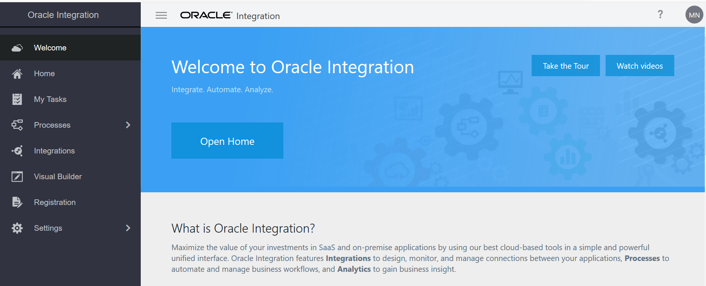
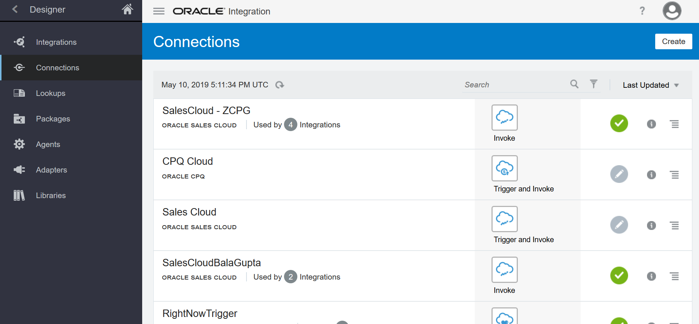
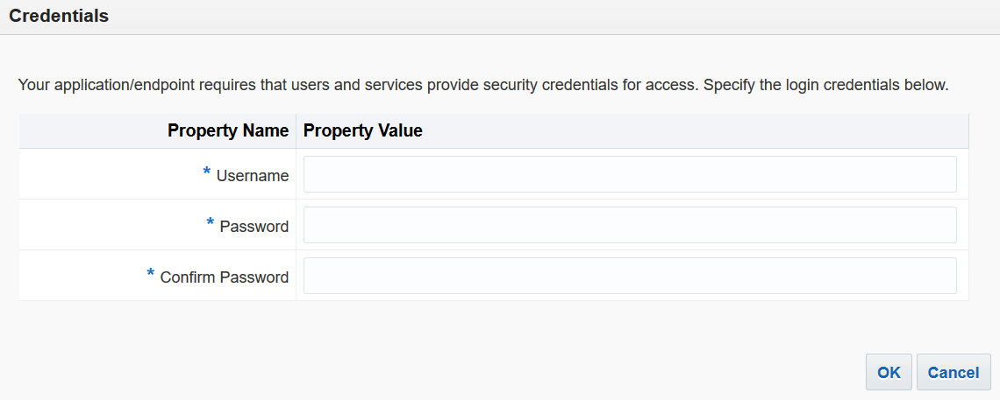
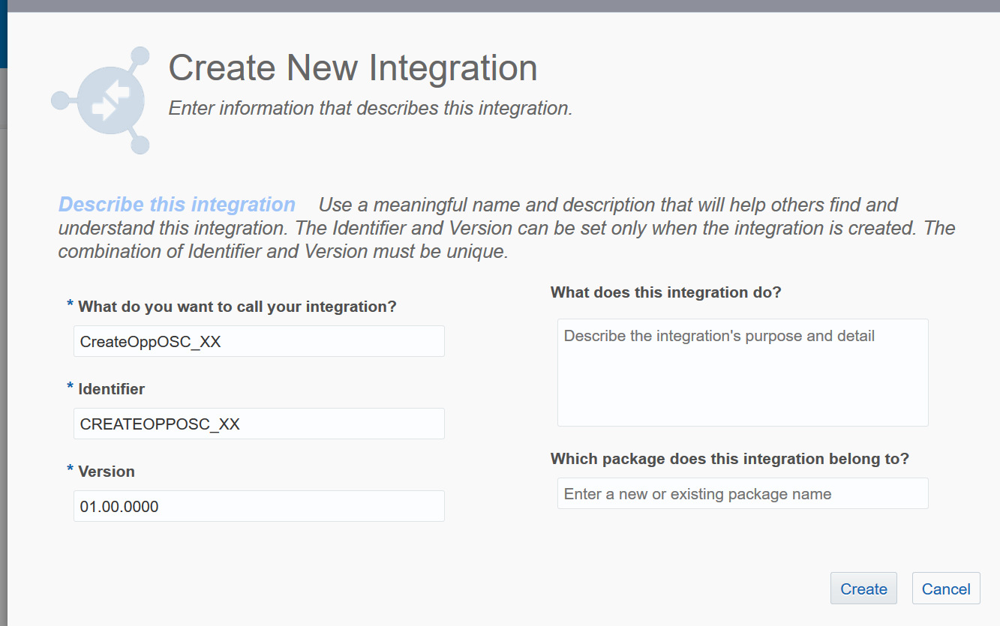

# Lab 1 - Desenvolvimento da Integração entre Oracle OIC
## Objetivos
- Passo 1: Criar um conector REST
- Passo 2: Criar um conector para o Oracle Sales Cloud
- Passo 3: Criar uma integração entre o conector rest e o conector Oracle Sales Cloud
### Passo 1
**1.1** Faça o login da sua conta no Oracle Cloud. Link será entregue pelo instrutor.

**1.2** Vá até o link *Integration* 

**1.3** Vá até o link *Connections* e depois *create* 

**1.4** Pesquisa por *REST* e escolha o conector

**1.5** Insira o nome `RestAdapterWorkshop_XX`, onde XX será o número entregue pelo instrutor. Em **Role** selecione  `Trigger` e então clique em **Create**. 

**1.6** Clique em **Save** e depois em **Close**

### Passo 2
**2.0** Repita os passos 1.3, 1.4 e 1.5. Porém agora o nome do conector será *Oracle Sales Cloud*. O nome da conexão insira `SalesCloudWorkshop_XX` (Onde XX será entregue pelo instrutor). Em **Role** selecione `Invoke` depois vá em **Create**.
**2.1** Na página de configuração do conector no seção **Connection Properties** clique em **Configure Connectivity** Configure a conexão utilizando a URL do *OSC - Oracle Sales Cloud*. Para obter as configurações necessários veja o link (https://docs.oracle.com/en/cloud/paas/integration-cloud/sales-adapter/prerequisites-creating-connection.html#GUID-8AF6BDD4-A711-480E-B71F-FAD062024A57) 

**2.1.1** Preencha em **OSC Services Catalog WSDL URL** com a informação que você pegou no item 1.8 ou utilize esta: https://testingapplication.com/fscmService/ServiceCatalogService?WSDL e substitua testingapplication.com pelo domínio do seu ambiente do OSC. 
**2.1.2** Preencham em **Interface Catalog URL (optional)** com a informação que você pegou no item 1.8 ou utilize esta: https://testingapplication.com/helpPortalApi/otherResources/latest/interfaceCatalogs e substitua testingapplication.com pelo domínio do seu ambiente do OSC.

**2.1.3** Na seção **Security** clique em **Configure Security** e preencha o login e senha de um usuário do OSC. Clique em **OK**

**2.2** Agora clique em **Test** e aguarda até o *Oracle Integration Cloud* efetuar o teste e validar a conexão com o OSC. Após o teste efetuar com sucesso observe o *label* de porcentagem, ele deverá aparecer 100% conforme figura abaixo.

**2.3** Com o *label* de porcentagem em 100% clique em **Save** e depois **Close**.
### Passo 3
**3.1** No canto esquerdo da tela clique em **Integrations** e depois no canto direito da tela em **Create**. Escolhe a opção **Basic Routing**.

**3.2** Preencha o nome da integração como `CreateOppOSC_XX` e depois clique em **Create**.

**3.3** Na próxima tela, busque no campo direito pelo conexão `RestAdapterWorkshop_XX`, arraste ela até o campo *Drag and Drop a Trigger*
