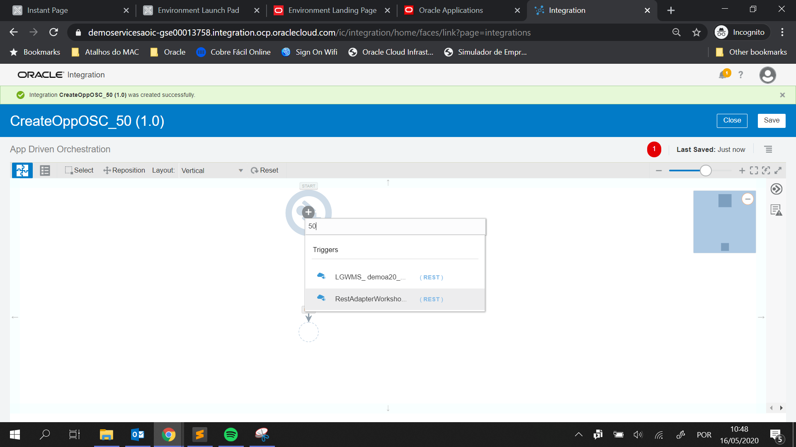
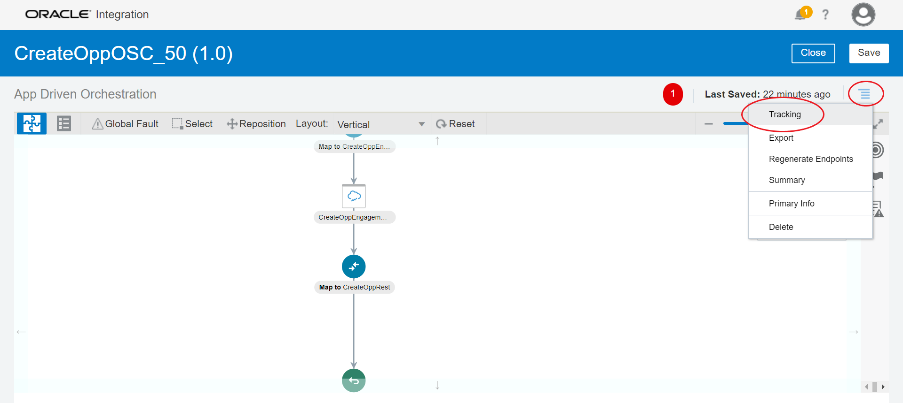

# Lab 1 - Desenvolvimento da Integração entre Oracle OIC
## Objetivos
- Passo 1: Criar um conector REST
- Passo 2: Criar um conector para o Oracle Sales Cloud
- Passo 3: Criar uma integração entre o conector rest e o conector Oracle Sales Cloud
- Passo 4: Efetuar teste para criação de uma oportuniade

## Pré-Requisitos
Leia os Links abaixo:
- Ter acesso ao OIC
- Ter acesso ao Oracle Sales Cloud
- Link dos serviços do Sales Cloud - [Veja como obter os links](https://docs.oracle.com/en/cloud/paas/integration-cloud/sales-adapter/prerequisites-creating-connection.html#GUID-8AF6BDD4-A711-480E-B71F-FAD062024A57)
- Ler o material: [Developing Integrations with Oracle Integration Cloud Service](https://docs.oracle.com/en/cloud/paas/integration-cloud-service/icsug/mapping-data-and-creating-lookups.html) 
- Ver o material: [Como usar o mapeamento](https://www.youtube.com/watch?v=6xNUpB7z9mA "Mapping Data in Oracle Integration Cloud Service")

### Passo 1
**1.1** Faça o login da sua conta no Oracle Cloud. Link será entregue pelo instrutor.


**1.2** Vá até o link *Integration* .


**1.3** Vá até o link *Connections* e depois *create*. 


**1.4** Pesquisa por *REST* e escolha o conector.


**1.5** Insira o nome `RestAdapterWorkshop_XX`, onde XX será o número entregue pelo instrutor. Em **Role** selecione  **Trigger** e então clique em **Create**. 


**1.6** Clique em **Save** e depois em **Close**


### Passo 2
**2.0** Repita os passos 1.3, 1.4 e 1.5. Porém agora o nome do conector será *Oracle Sales Cloud*. O nome da conexão insira `SalesCloudWorkshop_XX` (Onde XX será entregue pelo instrutor). Em **Role** selecione **Invoke** depois vá em **Create**.

**2.1** Na página de configuração do conector no seção **Connection Properties** clique em **Configure Connectivity** Configure a conexão utilizando a URL do *OSC - Oracle Sales Cloud*. Para obter as configurações necessários veja o [link](https://docs.oracle.com/en/cloud/paas/integration-cloud/sales-adapter/prerequisites-creating-connection.html#GUID-8AF6BDD4-A711-480E-B71F-FAD062024A57).


**2.1.1** Preencha em **OSC Services Catalog WSDL URL** com a informação que você pegou no item [Link dos serviços do Sales Cloud](https://github.com/matheuzum/Oracle/blob/master/paas4saas/lab1.md#pr%C3%A9-requisitos) ou utilize esta: `https://testingapplication.com/fscmService/ServiceCatalogService?WSDL` e substitua testingapplication.com pelo domínio do seu ambiente do OSC.

**2.1.2** Preencham em **Interface Catalog URL (optional)** com a informação que você pegou no item [Link dos serviços do Sales Cloud](https://github.com/matheuzum/Oracle/blob/master/paas4saas/lab1.md#pr%C3%A9-requisitos) ou utilize esta: `https://testingapplication.com/helpPortalApi/otherResources/latest/interfaceCatalogs` e substitua testingapplication.com pelo domínio do seu ambiente do OSC.


**2.1.3** Na seção **Security** clique em **Configure Security** e preencha o login e senha de um usuário do OSC. Clique em **OK**


**2.2** Agora clique em **Test** e aguarde até o *Oracle Integration Cloud* efetuar o teste e validar a conexão com o OSC. Após o término do teste, observe o *label* de porcentagem, ele deverá aparecer 100% conforme figura abaixo:


**2.3** Com o *label* de porcentagem em 100% clique em **Save** e depois **Close**.


### Passo 3
**3.1** No canto esquerdo da tela clique em **Integrations** e depois no canto direito da tela em **Create**. Escolhe a opção **Basic Routing**.


**3.2** Preencha o nome da integração como `CreateOppOSC_XX` onde XX será o número entregue pelo instrutor. Depois clique em **Create**.


**3.3** Na próxima tela, busque no campo direito (1) pelo conexão `RestAdapterWorkshop_XX` (2), arraste ela até o campo *Drag and Drop a Trigger* (3).


**3.4** Configurando o adaptador rest

**3.4.1** Preenche os campos conforme imagens abaixo:



**3.4.2** Clique em  **Next >**

Agora no campo **Select the request payload format** selecione a opção **JSON Sample** e depois clique em **<<< inline >>>**


**3.4.2.1** No campo **Enter Sample JSON** digite o código abaixo e depois clique em **OK**:

```json
{
	"nomeOportunidade" : "Nome da Oportuniade",
	"loginOwner" : "amanda.bell",
	"probabilidadeGanhar" : 10
}
```


**3.4.3** Selecione **JSON** como tipo do Payload que o endpoint irá receber e depois clique em **Next >**


**3.4.4** Agora no campo **Select the response payload format** selecione a opção **JSON Sample** e depois clique em **<<< inline >>>**


**3.4.4.1** No campo **Enter Sample JSON** digite o código abaixo e depois clique em **OK**:

```json
{ "idOportuniade" : "123095" }
```


**3.4.5** Selecione **JSON** como tipo do Payload que o endpoint irá responder e depois clique em **Next >**


Na tela *Summary*, confira se as configurações estão correstas em **Endpoint Summary** e depois clique em **Done**


**3.5** Na tela principal, busque no campo direito (1) pelo conexão `SalesCloudWorkshop_XX` (2), arraste ela até o campo *Drag and Drop a Invoke* (3).


**3.6** Configurando o adaptador SalesCloud

**3.6.1** Preenche os campos conforme imagens abaixo e depois em **Next >**.


**3.6.2** No Campo **Browse By** selecione **Business Objects** (1). No campo **Select a Business Object** escolha a opção **Opportunity : OpportunityService** (2) e no campo **Select the Operation to Perform on the Business Object** selecione a opção **createOpportunity**, conforme imagem abaixo, e depois clique em **Next >**.


**3.6.3** Clique em  **Done**


**3.7** Configurando uma chamada para recuperar o ID do *Owner* da Oportunidade:

**3.7.1** Do lado direito da tela procure novamente pela conexão `SalesCloudWorkshop_XX` e arraste até o **+** no canto esquerdo, conforme indicado na figura abaixo:


**3.7.2** Após abrir a tela de configuração desta integração coloque o nome da integração como `GetUserByUsername` e depois clique em **Next >**


**3.7.3** No Campo **Browse By** selecione **Services**. No campo **Select a Service** escolha a opção **ResourceService** e no campo **Select the Operation to Perform on the Business Service** selecione a opção **findResource**, conforme imagem abaixo, e depois clique em **Next >**.


**3.8** Mapeamento a chamada para recuperar o ID do *Owner* da Oportuniade.

Caso você tenha dúvidas de como efetuar o mapeamento veja o link que está na seção Pré Requisitos: Como usar o mapeamento. [[1]][mapeamento]

**3.8.1** Clique no mapeamento mais a esquerda da tela e depois em **+**, conforme figura abaixo:


**3.8.2** Vá navegando do lado direito da tela, abrindo os campos até chegar no campo **attribute** conforme imagem abaixo. Clique em cima do campo **attribute** para abrir a tela de construção de mapeamento.


**3.8.3** No lugar indicado em vermelho coloque o valor `Username`, clique em **Save** e depois **Close**:


**3.8.4** Repita os passos 3.8.1 e 3.8.2 para o campo **operator**. O valor será `=`

**3.8.5** Por último arraste, utilizando o mouse, o campo `loginOwner` para o campo **value**. A sua tela de mapeamento deverá ficar igual a tela abaixo:


**3.8.6** Clique em **Validate** depois em **Close**

**3.9** Mapeamento da chamado para a conexão do Sales Cloud:

Caso você tenha dúvidas de como efetuar o mapeamento veja o link que está na seção Pré Requisitos: Como usar o mapeamento. [[1]][mapeamento]

**3.9.1** Clique no mapeamento mais ao centro e acima da tela e depois em **+**, conforme figura abaixo:


**3.9.2** Faça o mapeamento arrastando os campos da esquerda para a direita conforme figura abaixo:

    CurrencyCode = USD (campo fixo)
    nomeOportunidade ===> Name
    probabilidadeGanhar ===> WinProb
    PartyID ===> OwnerResourcePartyId


**3.9.3** Clique em **Validate** depois em **Close**

**3.10** Mapeamento de retorno da chamada do Sales Cloud

**3.10.1** Clique no mapeamento mais ao centro e abaixo da tela e depois em **+**, conforme figura abaixo:


**3.10.2** Faça o mapeamento arrastando os campos da esquerda para a direita conforme figura abaixo:

    OptyId ===> idOportunidade


**3.10.3** Clique em **Validate** depois em **Close**

**3.11** Rastreamento das chamadas

**3.11.1** Clique em **Tracking**, conforme figura abaixo:



**3.11.2** Arraste as variáveis do lado esquerdo para os campos do lado direito, conforme figura abaixo:


**3.11** Após isso, verifique se o campo de porcentagem de atividades está igual a 100%, se estiver clique em **Save** e depois em **Close**


### Passo 4

**4.1** Ative a integração e habilite o rastreamento conforme imagem abaixo:


Habilite as opções conforme imagem abaixo:


**4.2** Após a ativação, recupere o *endpoint* através do ícone *engrenagem*.


**4.3** Abre o software Postam, você pode fazer o download [aqui](https://www.getpostman.com/ "Postman"). Preencha as informações conforme imagem abaixo:

O método você deverá colocar **POST** e a **URL** deverá ser a URL recuperada no item 4.2.


**4.4** Clique em **Authorization** e preencha os campos: **Type** deverá ser **Basic Auth** e o **Username** e **Password** deverão ser utilizados os que você utilizou para se logar no Oracle Integration Cloud - OIC. 


**4.5** Clique em **Body** e selecione a opção **raw** e coloque o json de teste: 
```json
{
	"nomeOportunidade" : "Nome da Oportuniade",
	"loginOwner" : "amanda.bell",
	"probabilidadeGanhar" : 10
}
```


**4.5** Clique em **Send** e espere a resposta. Ela deverá conter um json de resposta, parecido com a imagem abaixo:


**4.6** Volte para o Oracle Integration Cloud - OIC e clique em **<**. mensagem. 


**4.7** Clique em **Monitoring** -> **Tracking**. Observe que a sua mensagem está aparecendo em verde. Clique em cima da mensagem e observe o caminho feito pela 


Agora você está pronto para ir para o **Lab2: Desenvolvimento de um processo de negócio utilizando Process Cloud Service - OIC e integrando com Oracle Sales Cloud**

[mapeamento]: https://github.com/matheuzum/Oracle/blob/master/paas4saas/lab1.md#pr%C3%A9-requisitos "Como usar o mapeamento"