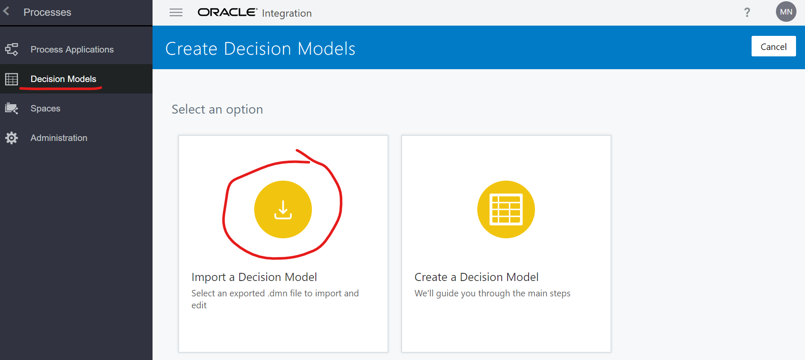
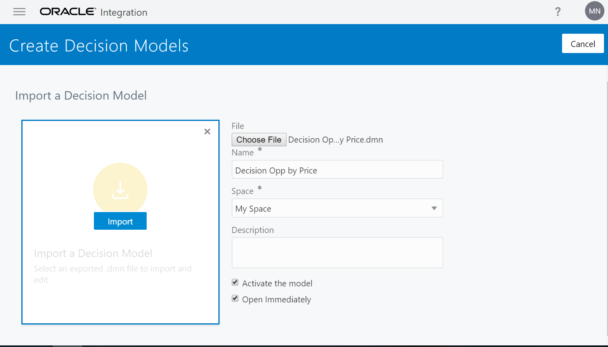

# Lab 2 - Desenvolvimento de um processo de negócio utilizando Process Cloud Service - OIC e integrando com Oracle Sales Cloud
## Objetivos
- Passo 1: Criar Processo de Negócio
- Passo 2: Criar integração com com o Integration Cloud
- Passo 3: Análise da aplicação criada e da implementação da tabela de decisão
- Passo 4: Efetuar teste e deploy
- Passo 5: Configurar usuários para nova aplicação
- Passo 6: Criar uma tarefa utilizando o *My Tasks*

## Pré-Requisitos
Leia os Links abaixo:
- Executar o Lab 1
- Ter acesso ao OIC Enterprise Edition
- Ver o material: [Como usar o mapeamento](https://www.youtube.com/watch?v=7sjLVKJeCrU "Explore a Simple Approval Process Application")

### Passo 1
**1.1** Faça o login da sua conta no Oracle Integration Cloud. Link será entregue pelo instrutor.

**1.2** Vá na opção **Processes** -> **Decision Models** -> **Create** -> **Import a Decision Model**

**1.3** Selecione o arquivo [Decision Opp by Price.dmn](files/Decision%20Opp%20by%20Price.dmn) e selecione as opções **Activate the model** e **Open Immediately**. O nome do `Decision Model` deverá ficar como **Decision Opp by Price**

**1.3** Vá na opção **Processes** -> **Process Applications** -> **Create** -> **Import a Application**

**1.4** Agora vá na opção **Processes** -> **Process Applications** -> **Create** -> **Import a Application**

**1.5** Faça o upload do arquivo [CreateOpp.exp](files/CreateOpp.exp) no campo **Name** preencha `CreateOpp_XX` (Onde XX será entregue pelo instrutor).

Tela após a importação

### Passo 2

**2.1** Do lado esquerdo da tela selecione a opção **Integrations** -> **Create** -> **Use a Integration**

**2.2** Agora escolha a integração que você criou no Lab1, no meu exemplo é a integração chamada `CreateOppOSC_XX` onde XX é um exemplo, escolha a opção com o número que o instrutor te forneceu e depois clique em **Create**. 

Resultado após a criação

### Passo 3

**3.1** Do lado direito da tela selecione a opção **Process** -> **ProcessCreateOppOnSalesCloud**.

**3.2** Faça uma análise do processo criado, ele contempla vários exemplos como os componentes *User Task* e *Decision*. Navegue nas telas para entender como foi desenvolvido. 

**3.3** Do lado direito da tela selecione a opção **Decisions** -> **DecisionOppByPrice**.

**3.4** Observe como foi implementado a tabela de decisão. 
> Caso você queira mais informações acesse a documentação: [Decision Models](https://docs.oracle.com/en/cloud/paas/integration-cloud/user-processes/create-decisions.html)

### Passo 4

**4.1** Volte para o processo de negócio desenhado. Do lado direito da tela selecione a opção **Process** -> **ProcessCreateOppOnSalesCloud**. 

**4.2** Clique no elemento *Call OIC Integration*, depois no ícone de opções -> **Open Properties**

**4.3** No campo **Integration** selecione a integração que você criou no passo 2.2. No meu caso é a integração chamada `CreateOppOSCXX` 

**4.4** Clique no ícone de opções a direita da tela e depois em **Validate Application**. 

Se estiver tudo correto aparecerá uma mensagem parecida como *The last CreateOpp_XX application validation was successful* em verde. Clique no ícone de teste, conforme imagem abaixo. Caso contrário corrija os erros que apareceram. 

**4.5** Clique nos icones indicados, conforme as imagens abaixo, para iniciar o teste. 

**4.6** Preenche os campos conforme imagem abaixo e depois clique em **Submit**

**4.7** O processo irá andar e deverá parar na atividade **User Task**. Quando o processo parar nesta atividade clique no ícone indicado e depois clique em **APROVADO**, para aprovar a criação da oportuniade.

**4.8** Caso a linha vermelha do processo fique parada, você pode utilziar o botão de *refresh* conforme tela abaixo.

**4.9** Após a linha vermelha andar até o final do processo, conforme imagem abaixo, clique no ícone indicado para finalizar o teste.

**4.10** Agora que o processo funcionou corretamente precisamos salvar e publicar uma versão para *deploy*. Para isso clique em **Save**

**4.11** Clique em **Publish** (1), selecione a opção **Make snapshot** (2) e preencha a versão com `V_XX` e o campo **Comment** (3), depois clique em **Publish**. (4)

**4.12** Agora vamos ativar a aplicação e realizar o *deploy*. Para isso clique em **Activate** (1). Depois selecione a versão publicada no passo 4.11 (no meu exemplo é a V_XX)(2), depois clique em **> Validate** (3).

Clique em **> Options** e preencha a tela de **Activate Options** conforme imagens abaixo.

Confirme se sua versão foi publicada e clique em **Close**.

### Passo 5

**5.1** Agora vamos selecionar os usuários que terão o papel de vendedor, gerente de vendas, revisor do processo e dono do processo. Para isso vá até a página inicial do Oracle Integration Cloud e depois clique em **My Tasks** -> **Workspace** -> **Administration**.

Clique em **Workspace** 

Clique em **Administration**

**5.2** Agora pesquisa a aplicação que você criou e fez o deploy no passo 4. Para isso siga na seguinte ordem: **Manage Roles** (1) -> Pesquise utilizando o nome da sua aplicação (2), meu exemplo é `CreateOpp_XX` -> Clique em Pesquisar (3)

**5.3** Adicione um usuário para o papel `CreateOpp_XX.Sales Person`. Para isso siga os passos clicando na seguinte ordem: **CreateOpp_XX.Sales Person** (1) -> **Add Member** (2) -> Pesquisa o seu usuário que você está utilizando no OIC (3) -> selecione seu usuário (4) -> **OK** (5) -> **Save** (6) 

**5.4** Agora repita o passo 5.3, utilizando o mesmo usuário, para os demais papeis: 
- CreateOpp_XX.Sales Manager
- CreateOpp_XX.Process Reviewer
- CreateOpp_XX.Process Owner
- CreateOpp_XX.Analytics Viewer

### Passo 6

Vamos novamente criar uma oportunidade, agora usando a aplicação em produção.

**6.1** Para isso vá até a página inicial do Oracle Integration Cloud e selecione **My Tasks** -> **Initiate Request**.

Depois clique no nome da sua aplicação que deverá estar com o nome `Create Opportunity(1.0.0)`, fique com o mouse em cima do ícone para você verificar se é a sua aplicação.

**6.2** Preencha o formulário com os dados, conforme imagem abaixo. Para o campo **Quantidade do Produto** coloque 10 e **Preço do Produto** preencha com 15 e depois clique em **Submit**. 

**6.3** Crie mais uma requisição, porém agora com os valores, conforme tela abaixo. Para o campo **Quantidade do Produto** coloque 300 e **Preço do Produto** preencha com 600 e depois clique em **Submit**. 

**6.4** Clique em **Workspace** e depois clique no nome da processo, no meu caso `CreateOpp_XX`.

Clique em cima do nome do processo `CreateOpp_XX`

Clique em **APROVADO**

**6.5** Vá até a página inicial do Oracle Integration Cloud e nagegue pelo menu **Integrations** -> **Monitoring** -> **Tracking** e perceba que as duas requisões para o Oracle Sales Cloud ocorreram com sucesso. 

As duas chamadas do processo, chamaram o Integration que realizou a operação de cadastrar a oportunidade no Oracle Sales Cloud com sucesso.

Agora você está pronto para realizar os Labs:
- [**Lab3: Desenvolvimento de uma tela Mobile utilizando Oracle Mobile Cloud Service - MCS**](https://github.com/matheus-neia/Oracle/blob/master/paas4saas/lab3.md)
- [**Lab4: Desenvolvimento de uma tela utilizando o Oracle Visual Builder**](https://github.com/matheus-neia/Oracle/blob/master/paas4saas/lab4.md)